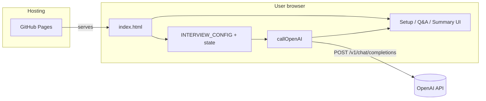

## itmapper

Your own AI interview assistant, tl;dr motivation [here](https://dejanualex.medium.com/reshaping-the-job-market-5be1b4afab01)

A lightweight, static web app for running an AI-powered mock technical interview in the browser. Page accessible at: [itmapper](https://itmapper.github.io)

  - It lets a user enter a topic, choose question count, provide an OpenAI API key, and answer adaptive interview questions.
  - The app tracks progress and returns a final summary/assessment after all answers.
  - Architecture is intentionally simple: mostly index.html (UI + logic), hosted on GitHub Pages, with no backend in this repo.


### Architecture

Static single-page app: everything runs in the browser; there is no backend in this repo.



- **index.html** bundles markup, inline CSS, and interview logic.
- The OpenAI **API key** is supplied in the form at runtime and sent only from the browser to OpenAI (not stored by this site).

### Python MCP server (`interviewnow`)

This repo now includes a minimal MCP server at `mcp_server/server.py` that provides:
- Prompt: `interviewnow`
- Tool: `open_interview_page`

`interviewnow` is designed to start the flow by opening `https://itmapper.github.io/` in the default browser, then guiding the user to start the interview from the page.

#### Setup

```bash
cd mcp_server
uv sync
uv run server.py

# start inspector
uv run mcp dev
```

Requirement: Python 3.10+ (the MCP Python SDK does not support Python 3.9).

#### Example MCP client config

* Add the mcp config to claude desktop: `/Users/YOURUSER/Library/Application Support/Claude/claude_desktop_config.json` or to claude code:

```json
{
  "mcpServers": {
    "itmapperInterview": {
      "command": "uv",
      "args": [
        "--directory",
        "/tmp/mcp_server/itmapper.github.io/mcp_server",
        "run",
        "server.py"
      ]
    }
  }
}
```

After connecting the server in your MCP client, invoke the `interviewnow` prompt to begin.
