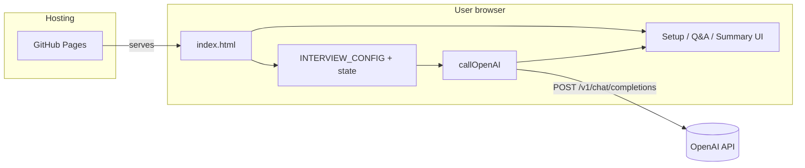

## itmapper

Your own AI interview assistant, tl;dr motivation [here](https://dejanualex.medium.com/reshaping-the-job-market-5be1b4afab01)

Page accessible at: [itmapper](https://itmapper.github.io)

### Architecture

Static single-page app: everything runs in the browser; there is no backend in this repo.

- **index.html** bundles markup, inline CSS, and interview logic.
- The OpenAI **API key** is supplied in the form at runtime and sent only from the browser to OpenAI (not stored by this site).
